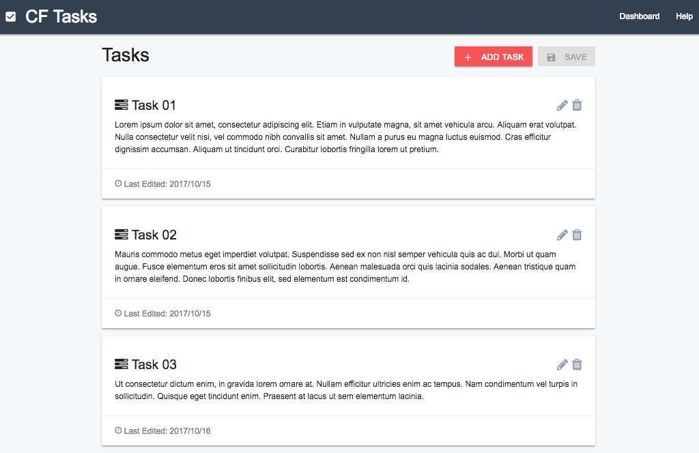
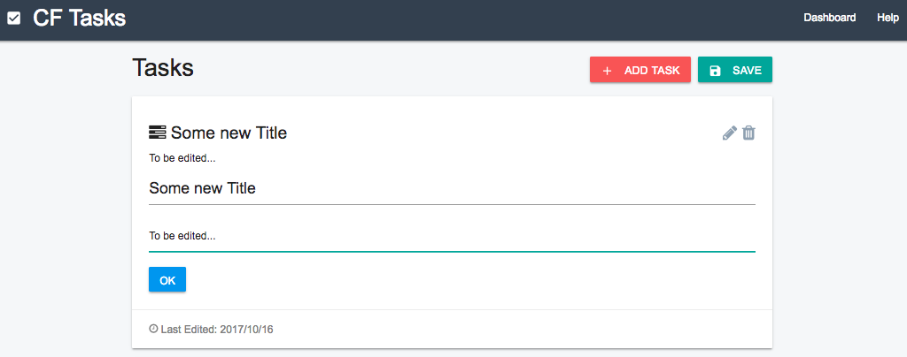

# CrowdFlower Assignment

A small programming assignment to manage tasks.

#### How to Use

Download or clone the project and install modules to run the app:

```
git clone https://github.com/qqqlllyyyy/crowdflower-assignment
cd crowdflower-assignment
npm install
npm start
```

#### Additional Modules

* redux
* react-redux
* redux-thunk
* react-router-dom
* axios
* materialize-css
* react-dragula
* react-alert
* enzyme
* react-test-renderer
* enzyme-adapter-react-16

#### Select ScreenShots




